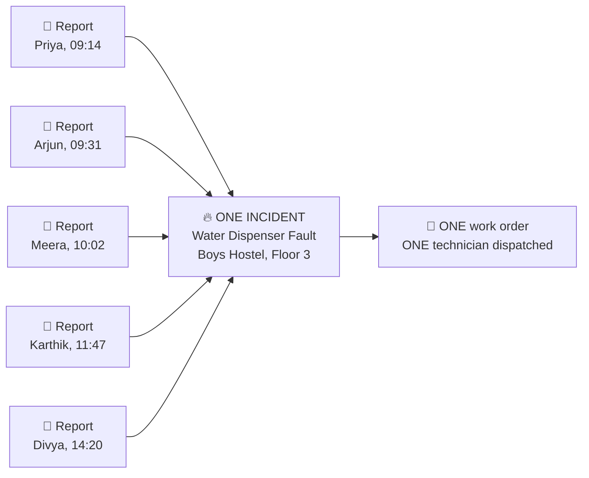

# CampusPulse

**A multi-tenant campus facility incident management database — schema, synthetic data engine, integrity audit and analytics suite, built on PostgreSQL/Supabase with `psycopg2`.**

<p align="center">
  
  
  
  
  
</p>

---

## Table of contents

1. [The problem](#1-the-problem)
2. [What CampusPulse is](#2-what-campuspulse-is)
3. [The one idea that makes it work](#3-the-one-idea-that-makes-it-work)
4. [Quick start](#4-quick-start)
5. [Repository layout](#5-repository-layout)
6. [Database design](#6-database-design)
7. [The synthetic data engine](#7-the-synthetic-data-engine)
8. [Integrity verification](#8-integrity-verification)
9. [Analytics: fourteen questions](#9-analytics-fourteen-questions)
10. [Selected findings](#10-selected-findings)
11. [Multi-tenant SaaS design](#11-multi-tenant-saas-design)
12. [Technology choices and why](#12-technology-choices-and-why)
13. [Security notes](#13-security-notes)
14. [Limitations and honest caveats](#14-limitations-and-honest-caveats)
15. [Possible extensions](#15-possible-extensions)
16. [Documentation index](#16-documentation-index)

---

## 1. The problem

On a typical university campus, a broken water dispenser is reported like this:

> A student tells a warden. The warden mentions it to someone in the facilities
> office. A WhatsApp photo circulates. Two other students independently complain
> at the front desk. Somewhere in that chain the request is written on paper —
> or lost.

Four failure modes fall out of this, and every one of them is a **data** problem:

| Failure | Consequence |
|---|---|
| **No single record of truth** | Nobody can answer "how many open issues do we have right now?" |
| **Duplicate effort** | Five reports of one fault dispatch five separate technician visits. |
| **No accountability clock** | Nothing records when a request was raised, so nothing can be overdue. |
| **No history** | The same dispenser fails six times a year and nobody ever notices the pattern. |

Every one of those is solved by modelling the domain properly and storing it in
a relational database. That is the whole thesis of this project.

---

## 2. What CampusPulse is

CampusPulse is the **data layer** for a campus facility management platform: a
production-grade PostgreSQL schema, plus the Python tooling to build it, fill it
with realistic activity, prove the result is sound, and interrogate it.

It is designed as **multi-tenant SaaS** — one deployment serves many
institutions, each seeing only its own data.

### What actually ships

| Deliverable | Detail |
|---|---|
| **Schema** | 16 tables, 9 ENUM types, 34 foreign keys, 68 indexes, 4 reporting views, 1 trigger |
| **Synthetic dataset** | ~42,600 rows spanning 18 months across 3 institutions |
| **Integrity audit** | 47 automated checks — population, tenant isolation, structure, lifecycle, business rules, statistical plausibility |
| **Analytics suite** | 14 business questions answered with recursive CTEs, window functions, `FILTER` aggregates and statistical functions |
| **Documentation** | Auto-generated data dictionary, ERD with Mermaid diagrams, setup guide |

### Verified run output

Every figure below is from an actual execution against a live Supabase instance,
not an estimate.

```
Schema build      16 tables · 4 views · 68 indexes · 9 ENUMs · 34 FKs     6.5 s
Data generation   42,642 rows generated in memory                         0.3 s
Data load         42,642 rows inserted via execute_values                12.2 s
Integrity audit   47 of 47 checks passed                                   ✓
Analytics         14 queries · 162 rows returned                        3.34 s
```

| Table | Rows | Table | Rows |
|---|---:|---|---:|
| `institutions` | 3 | `incidents` | 2,985 |
| `users` | 1,200 | `reports` | 5,367 |
| `user_roles` | 47 | `incident_reports` | 5,367 |
| `locations` | 780 | `work_orders` | 2,495 |
| `categories` | 150 | `status_history` | 11,402 |
| `service_teams` | 18 | `notifications` | 8,749 |
| `team_members` | 78 | `attachments` | 944 |
| `assets` | 2,499 | `feedback` | 558 |

---

## 3. The one idea that makes it work

If you remember nothing else from this project, remember the split between
**reports** and **incidents**.



- A **report** is *what a person said*. It is raw, subjective, and duplicated.
- An **incident** is *what is actually broken*. It is de-duplicated and is the
  unit of work.

The `incident_reports` junction table links them many-to-one, with a
`UNIQUE (report_id)` constraint guaranteeing a report can never belong to two
incidents.

**Why it matters, measured:** in the generated dataset, 5,367 reports collapse
into 2,985 incidents — an average of **1.80 reports per incident**, with **44.4%
of reports being duplicates**. Naive one-visit-per-report handling would have
dispatched **2,382 unnecessary technician visits** over 18 months. Query 5 in
the analytics suite computes exactly this.

---

## 4. Quick start

```bash
# 1. Clone and enter
git clone https://github.com/YOUR_USERNAME/campuspulse-capstone.git
cd campuspulse-capstone

# 2. Virtual environment
python -m venv .venv
.\.venv\Scripts\Activate.ps1        # Windows
# source .venv/bin/activate         # macOS / Linux

# 3. Dependencies
pip install -r requirements.txt

# 4. Credentials
copy .env.example .env              # Windows   (cp on macOS/Linux)
#    then edit .env with your Supabase host / password

# 5. Run the whole pipeline
python 00_Run_All.py --yes
```

Or step through it, which is more instructive the first time:

```bash
python db_config.py                 # connection smoke test
python 01_Create_Schema.py          # build the schema
python 02_Insert_Data.py            # generate + load synthetic data
python 03_Verify_Data.py            # 47 integrity checks
python 04_Analytics_Queries.py      # 14 business questions
python 05_Export_Documentation.py   # regenerate the data dictionary
```

Full instructions, including troubleshooting, are in
**[`docs/SETUP.md`](docs/SETUP.md)**.

---

## 5. Repository layout

```
campuspulse-capstone/
│
├── db_config.py                 Shared connection helper. Loads .env, retries
│                                transient failures, falls back to the Supabase
│                                session pooler on IPv4-only networks.
│
├── 00_Run_All.py                Pipeline orchestrator (stages 0-4).
├── 01_Create_Schema.py          ⭐ Builds all 16 tables, ENUMs, indexes, views.
├── 02_Insert_Data.py            ⭐ Generates + bulk-loads the synthetic dataset.
├── 03_Verify_Data.py            47 integrity / plausibility checks. CI-ready.
├── 04_Analytics_Queries.py      14 analytical questions with SQL + commentary.
├── 05_Export_Documentation.py   Regenerates the data dictionary from pg_catalog.
│
├── sql/
│   └── schema.sql               Reference DDL dump (generated, not authoritative).
│
├── docs/
│   ├── ERD.md                   Mermaid ERD, workflow and state machine diagrams.
│   ├── DATA_DICTIONARY.md       Auto-generated column-level reference.
│   └── SETUP.md                 Step-by-step setup and troubleshooting.
│
├── .vscode/                     Interpreter path, recommended extensions and
│                                six ready-made debug configurations.
│
├── .env.example                 Credential template. Copy to .env (git-ignored).
├── requirements.txt             Four pinned dependencies.
└── README.md                    This file.
```

The two files marked ⭐ are the ones named in the original assignment brief. The
other four exist because a schema you cannot verify, query or document is only
half a deliverable.

---

## 6. Database design

The full column-level reference lives in
**[`docs/DATA_DICTIONARY.md`](docs/DATA_DICTIONARY.md)** (auto-generated from the
live catalog) and the diagrams in **[`docs/ERD.md`](docs/ERD.md)**. What follows
is the reasoning.

### 6.1 The sixteen tables

| # | Table | Role |
|---|---|---|
| 1 | `institutions` | Tenant root. One row per college. |
| 2 | `users` | Students, faculty, admins, technicians. |
| 3 | `user_roles` | Secondary roles (someone can be faculty *and* a technician). |
| 4 | `service_teams` | Electrical, Plumbing, IT Support, Housekeeping, Carpentry, Security. |
| 5 | `team_members` | Junction: which technicians staff which team. |
| 6 | `locations` | Self-referencing tree: campus → building → floor → room/area. |
| 7 | `categories` | Self-referencing taxonomy for both issue types and asset types. |
| 8 | `assets` | QR-tagged physical items. |
| 9 | `reports` | Raw user submissions. |
| 10 | `incidents` | De-duplicated real-world problems. The unit of work. |
| 11 | `incident_reports` | Junction implementing many-reports-to-one-incident. |
| 12 | `work_orders` | Dispatch record: team, technician, labour, cost. |
| 13 | `status_history` | Append-only audit trail of every state transition. |
| 14 | `notifications` | Outbound messages (email / in-app / SMS). |
| 15 | `attachments` | Polymorphic file store. |
| 16 | `feedback` | Post-closure satisfaction rating, 1–5. |

Tables 1–15 implement the original UML directly. **`team_members` (5) is an
addition** — the UML showed a relationship between `user_roles` and
`service_teams` without resolving it. Without a junction table there is no way to
verify that a work order's assignee actually belongs to the team it was assigned
to. Check 34 in the audit suite tests exactly that invariant.

### 6.2 ENUMs over free text

Nine ENUM types encode the domain's controlled vocabularies:

```sql
CREATE TYPE campuspulse.incident_status AS ENUM
    ('reported', 'acknowledged', 'in_progress', 'resolved', 'closed');
```

A status of `'in progress'`, `'IN_PROGRESS'` or `'inprogres'` is not a bug to be
caught in review — it is a row the database physically refuses to store. In a
`text` column, all three would sit there quietly and break every `GROUP BY` for
the rest of the system's life.

### 6.3 Constraints that make bad states unrepresentable

The `incidents` table carries CHECK constraints written as **equivalences**, not
implications:

```sql
CONSTRAINT incidents_resolution_consistent
    CHECK ((status IN ('resolved','closed')) = (resolved_at IS NOT NULL)),

CONSTRAINT incidents_closure_consistent
    CHECK ((status = 'closed') = (closed_at IS NOT NULL)),
```

Written this way, drift is impossible in *either* direction: you can neither mark
an incident resolved without a timestamp, nor leave a stray `resolved_at` on an
incident that was reopened. Alongside them sit temporal constraints
(`resolved_at >= created_at`, `closed_at >= resolved_at`) and domain constraints
(`rating BETWEEN 1 AND 5`, `sla_hours > 0`, `material_cost >= 0`).

The design principle throughout: **push invariants down to the lowest layer that
can enforce them.** An invariant enforced in application code holds until someone
writes a second application. An invariant enforced by a constraint holds always.

### 6.4 Self-referencing hierarchies

Both `locations` and `categories` are trees via a nullable `parent_id`. This is
what lets one recursive CTE roll room-level incidents up to buildings:

```sql
WITH RECURSIVE tree AS (
    SELECT l.id AS building_id, l.name, l.institution_id, l.id AS descendant_id
      FROM campuspulse.locations l WHERE l.type = 'building'
    UNION ALL
    SELECT t.building_id, t.name, t.institution_id, child.id
      FROM tree t
      JOIN campuspulse.locations child ON child.parent_id = t.descendant_id
)
SELECT ...
```

Inserting a new "Wing" level between Building and Floor requires **zero** schema
changes and **zero** query rewrites.

### 6.5 Indexing strategy

68 indexes exist, and every one of them serves a specific query in
`04_Analytics_Queries.py`. Indexes that serve no query are pure write-cost, so
none were added speculatively. Several are **partial**, indexing only the rows
that are actually queried:

```sql
CREATE INDEX idx_incidents_open
    ON campuspulse.incidents (institution_id, sla_due_at)
    WHERE status NOT IN ('resolved', 'closed');
```

The open-backlog dashboard only ever asks about unresolved incidents, so the
index stores only those — a fraction of the table, and it stays small as
resolved history accumulates.

### 6.6 Reporting views

Four views encode the joins the dashboard needs, so BI tools query business
concepts rather than re-deriving eight-table joins:

| View | Answers |
|---|---|
| `v_incident_details` | Flat incident record with resolution time and SLA breach flag |
| `v_location_heatmap` | Incident density per location |
| `v_team_performance` | Throughput, cost and satisfaction per team |
| `v_sla_compliance` | Met vs breached, per category |

---

## 7. The synthetic data engine

`02_Insert_Data.py` is the heart of the "data generating" brief. The goal is not
to fill tables — `INSERT ... SELECT random()` would do that. The goal is data
whose **statistical shape** matches how a real maintenance system behaves, so
that the analytics return findings that actually mean something.

### 7.1 What is modelled

| Property | How |
|---|---|
| **Report → incident aggregation** | Incidents generated first (they are the real-world faults); each then attracts 1–5 independent reports drawn from a weighted distribution. Every report after the first is flagged `is_duplicate`. |
| **Day-of-week rhythm** | Weights `[Mon 1.00 … Fri 0.90, Sat 0.55, Sun 0.28]`. Campus is quiet at weekends. |
| **Hour-of-day rhythm** | Two peaks — mid-morning and mid-afternoon — with a lunch dip and a long evening tail. |
| **Academic calendar** | Semester peaks (Feb–Apr, Aug–Nov) and a summer trough (May–Jun at 0.40–0.45). |
| **Adoption ramp** | Activity scales from 0.35 to 1.0 across the window, so the platform looks gradually rolled out rather than switched on fully formed. |
| **Resolution time** | Beta-distributed against each category's SLA, multiplied by a log-normal jitter — fast for critical, long-tailed for low priority. |
| **Deliberate SLA breaches** | 14–27% by priority, so the compliance report is not a uniform wall of 100%. |
| **Failure hot spots** | 12% of rooms are marked failure-prone and receive 40% of incidents, giving the heatmap genuine signal. |
| **Satisfaction correlation** | Ratings are drawn conditional on whether the SLA was actually met, producing a real (not injected) negative correlation with resolution time. |

### 7.2 Reproducibility

Every random draw — **including the UUIDs** — comes from a single seeded
generator:

```python
def uid(self) -> str:
    """uuid.uuid4() reads os.urandom and is not seedable, so build from the RNG."""
    return str(uuid.UUID(int=self.rng.getrandbits(128), version=4))
```

`python 02_Insert_Data.py --seed 42` produces a byte-identical dataset on any
machine. `--seed 1234` produces a completely different but equally coherent one.

### 7.3 Scale presets

| Preset | Institutions | Users | Assets | Incidents | Total rows |
|---|---:|---:|---:|---:|---:|
| `small` | 1 | 200 | 400 | 800 | ~11,000 |
| `medium` *(default)* | 3 | 1,200 | 2,500 | 3,000 | ~42,600 |
| `large` | 5 | 6,000 | 12,000 | 20,000 | ~280,000 |

### 7.4 Loading performance

Rows are inserted with `psycopg2.extras.execute_values` at a page size of 1,000,
which batches many rows into a single multi-VALUES statement. The whole 42,642-row
load takes **12.2 seconds over the public internet** to a Supabase instance —
row-by-row `INSERT` would take several minutes.

The entire load runs inside **one transaction**. If anything fails, nothing is
left half-created; the database is either fully loaded or untouched.

---

## 8. Integrity verification

`03_Verify_Data.py` runs 47 checks and exits non-zero on any failure, so it can
drop straight into CI. Critically, it queries **the database**, not the
generator's in-memory state — so a bug in the generator cannot hide itself.

| Group | Checks | Examples |
|---|---:|---|
| **Population** | 10 | Every table holds rows; nothing silently failed to load. |
| **Tenant isolation** | 7 | No report, incident, asset or work order crosses institution boundaries. |
| **Structure** | 5 | Location tree has no cycles or orphans; asset tags and emails unique per tenant. |
| **Lifecycle** | 8 | Resolved incidents carry `resolved_at`; nothing is closed before it was resolved; no timestamp is in the future; `status_history` records the current status. |
| **Business rules** | 10 | Every incident has ≥1 report; no report belongs to two incidents; the first report is never a duplicate; assignees belong to their assigned team; feedback only follows closure. |
| **Plausibility** | 7 | Duplicate rate 15–60%; SLA breach 5–45%; weekday activity exceeds weekend; incidents span ≥300 distinct days. |

The **plausibility** group is the interesting one. The others verify
*correctness*; these verify *realism*. A dataset can be perfectly valid and still
useless for analysis — if reports were uniformly distributed across all seven
weekdays, no staffing analysis built on it would mean anything.

```
  Checks run    : 47
  Passed        : 47
  Failed        : 0
```

---

## 9. Analytics: fourteen questions

Each query in `04_Analytics_Queries.py` is stated as a **business question**
first and SQL second, because the point is not "we wrote SQL" but "we can turn
maintenance records into operational decisions."

| # | Question | Technique |
|---|---|---|
| 1 | How has volume trended month over month, and is the backlog growing? | `lag()`, running `sum() OVER` |
| 2 | Which rooms are the worst maintenance hot spots? | `FILTER` aggregates, multi-join |
| 3 | Which issue categories consume the most maintenance effort? | `percentile_cont` (median, p90) |
| 4 | How well is each category meeting its SLA? | View + `CASE` verdict banding |
| 5 | How much duplicate reporting does aggregation absorb? | Grouped histogram, cumulative window |
| 6 | Which assets fail repeatedly and should be replaced? | `HAVING`, cost rollup |
| 7 | Does higher priority actually get faster service? | `stddev_samp`, `percentile_cont` |
| 8 | When during the week do reports arrive? | Time bucketing with `FILTER` |
| 9 | How is each service team performing? | Multi-way `LEFT JOIN` aggregation |
| 10 | Does slower resolution reduce satisfaction? | `corr()` statistical aggregate |
| 11 | How old is the open backlog, and what is overdue? | `interval` bucketing |
| 12 | Roll room-level incidents up to buildings | **Recursive CTE** + `rank() OVER` |
| 13 | Which reporting channel are people using? | Quarterly cohorting |
| 14 | Where is the maintenance budget going? | Cost modelling, `% of total` window |

```bash
python 04_Analytics_Queries.py --list          # see the questions
python 04_Analytics_Queries.py --only 12       # run one
python 04_Analytics_Queries.py --explain 2     # inspect the query plan
python 04_Analytics_Queries.py --export out/   # write CSVs
```

---

## 10. Selected findings

These are real results from the generated dataset. They demonstrate that the
data supports genuine analysis rather than merely existing.

### Triage works — priority genuinely predicts speed

| Priority | Resolved | Avg ack (h) | Avg fix (h) | Median (h) | SLA met |
|---|---:|---:|---:|---:|---:|
| critical | 281 | 0.67 | 2.7 | 1.7 | 87.2% |
| high | 745 | 2.24 | 10.6 | 6.0 | 83.6% |
| medium | 663 | 3.74 | 21.2 | 11.8 | 76.2% |
| low | 254 | 10.43 | 67.0 | 34.7 | 72.8% |

A clean monotonic gradient across all four columns. Critical faults are
acknowledged in **40 minutes** and fixed in under **3 hours**; low-priority ones
wait over ten hours just to be looked at.

### Aggregation prevents 2,382 wasted dispatches

| Reports per incident | Incidents | % of total | Duplicate reports |
|---:|---:|---:|---:|
| 1 | 1,628 | 54.5% | 0 |
| 2 | 705 | 23.6% | 705 |
| 3 | 371 | 12.4% | 742 |
| 4 | 189 | 6.3% | 567 |
| 5 | 92 | 3.1% | 368 |

**45.5% of incidents attracted more than one report.** Without the
report/incident split, those would have generated **2,382 redundant technician
visits** over 18 months.

### Slow service measurably reduces satisfaction

| Rating | Responses | Avg fix (h) | Median (h) | Within SLA |
|---:|---:|---:|---:|---:|
| 5 | 203 | 13.4 | 5.7 | 96.6% |
| 4 | 197 | 13.0 | 6.7 | 90.9% |
| 3 | 85 | 35.4 | 12.8 | 60.0% |
| 2 | 42 | 60.2 | 27.8 | 21.4% |
| 1 | 31 | 55.9 | 26.7 | 22.6% |

Pearson correlation between rating and resolution hours: **−0.34**.

Note the sharper signal in the **Within SLA** column (96.6% → 22.6%) than in raw
hours. That is the operationally useful finding: what drives satisfaction is not
absolute speed but **whether the promised turnaround was met**. A four-hour fix
on a four-hour SLA scores better than a four-hour fix on a one-hour SLA.

### Hot spots are real and concentrated

Rolling room-level incidents up to buildings (recursive CTE, query 12):

| Institution | Building | Spaces | Incidents | Per space |
|---|---|---:|---:|---:|
| AMR | Main Academic Block | 37 | 204 | 5.51 |
| AMR | Computer Centre | 37 | 170 | 4.59 |
| AMR | Administrative Block | 37 | 100 | 2.70 |

The worst building generates **twice** the incidents per space of the best, at
identical size — a difference worth a root-cause investigation rather than
another round of individual repairs.

---

## 11. Multi-tenant SaaS design

The original brief asked whether this could serve any institution, not just one.
It can, and the schema was built for it from the first table.

### How isolation works

Every tenant-owned table carries `institution_id` **and** declares a
redundant-looking unique key:

```sql
CONSTRAINT users_tenant_key UNIQUE (id, institution_id)
```

That key is what lets child tables reference parents on **both** columns:

```sql
CONSTRAINT reports_location_same_tenant
    FOREIGN KEY (location_id, institution_id)
    REFERENCES locations(id, institution_id)
```

The consequence is worth stating plainly: **a report belonging to Amrita cannot
reference a location belonging to VIT.** PostgreSQL rejects the row.

Compare this with the usual approach — relying on the application to remember
`WHERE institution_id = ?` on every single query. That works until one developer
forgets it once, and then tenant data leaks. Here the isolation is *structural*,
and `03_Verify_Data.py` re-tests all seven cross-tenant paths to confirm the
constraints are genuinely in force rather than merely declared.

### Per-tenant customisation

Each institution defines its **own** locations, categories, SLA targets and
service teams. Amrita can set a 4-hour SLA on power outages while VIT sets 8,
with no schema change and no code branch.

### Onboarding a new institution

Insert one row into `institutions`, then its locations, categories and teams.
No migration, no redeploy, no per-tenant schema.

### Where this design stops

At roughly 50–100 institutions, `institution_id` filtering on shared tables
starts to strain and the natural next steps are PostgreSQL **Row-Level Security**
(which Supabase supports directly) and per-tenant table partitioning. Both are
additive — neither requires reworking what is here.

---

## 12. Technology choices and why

| Choice | Alternative considered | Reasoning |
|---|---|---|
| **PostgreSQL** | MySQL, MongoDB | Recursive CTEs, native ENUMs, partial indexes, `FILTER` aggregates and composite foreign keys are all load-bearing here. MySQL lacks several; MongoDB would push every integrity guarantee into application code. |
| **Supabase** | Local Postgres, AWS RDS | Managed Postgres 17 on a free tier, reachable from anywhere, with a browsable table editor — so the work is inspectable without a local install. |
| **`psycopg2`** | SQLAlchemy, `asyncpg` | The brief specified it, and it is the right call: an ORM would hide the SQL, which is the actual subject of the project. `execute_values` also gives excellent bulk-insert throughput. |
| **Dedicated `campuspulse` schema** | `public` | Keeps the project cleanly separated from Supabase's `public`, `auth` and `storage` schemas, so a full rebuild can never clobber platform objects. |
| **Client-side UUID PKs** | `BIGSERIAL` | Lets the generator build a complete, internally-consistent object graph in memory before touching the database, so the whole load runs as one batched transaction. |
| **`Faker`** | Hand-written name lists | Locale-aware (`en_IN`) names, emails and phone numbers appropriate to the setting. |

---

## 13. Security notes

- **Credentials never enter source control.** All connection settings load from
  `.env`, which is listed in `.gitignore`. `.env.example` ships as a template
  with placeholder values only.
- **TLS is mandatory.** Connections use `sslmode=require`.
- **Errors never leak secrets.** `db_config.describe_target()` prints host, port,
  database and user — never the password.
- **The schema is isolated.** All objects live in `campuspulse`; a destructive
  rebuild cannot touch Supabase's `public`, `auth` or `storage` schemas.
- **All data is synthetic.** Every name, email and phone number is generated by
  Faker. No real personal data is present anywhere in this repository.

> **If you fork this project:** create your own Supabase project and your own
> `.env`. Never commit a `.env`. If a password is ever exposed — pasted into a
> chat, a screenshot, or a commit — rotate it immediately under
> **Supabase → Settings → Database → Reset database password**.

---

## 14. Limitations and honest caveats

Stated plainly, because a capstone that claims no weaknesses is not being read
carefully.

1. **The data is synthetic.** It is *structurally* and *statistically* realistic
   by construction, but it is not empirical. Findings here demonstrate that the
   schema supports the analysis — they are not discoveries about any real campus.
2. **Correlations are partly by construction.** The rating/resolution-time
   correlation of −0.34 is real in the data, but it arises because the generator
   draws ratings conditional on SLA compliance. It validates the *analytical
   pipeline*, not human psychology.
3. **Duplicate detection is not implemented.** The generator *knows* which
   reports are duplicates because it created them that way. A production system
   would need real matching — spatial/temporal proximity plus text similarity
   (`pg_trgm`) or embeddings. That is the single largest gap between this and a
   deployable product.
4. **No authentication or authorisation layer.** The schema models roles, but
   enforcement would need Supabase Auth plus Row-Level Security policies.
5. **The cost model is nominal.** Query 14 prices labour at a flat ₹250/hour
   purely to make the output concrete. Real costing needs an actual rate card.
6. **Notifications are recorded, not sent.** The `notifications` table models
   what *would* be dispatched; no SMTP or Outlook integration exists.
7. **Attachment integrity is application-level.** The polymorphic
   `table_type`/`table_id` pattern cannot carry a declarative foreign key — a
   deliberate trade-off for flexibility, documented rather than hidden.

---

## 15. Possible extensions

Roughly ordered by value-to-effort:

| Extension | Notes |
|---|---|
| **Row-Level Security** | Supabase-native tenant enforcement at the database layer. |
| **Real duplicate detection** | `pg_trgm` similarity + spatial/temporal windowing on incoming reports. |
| **Predictive maintenance** | `assets` already carries `purchased_on` and failure history — enough to model time-to-next-failure. |
| **Materialised views** | The heatmap and SLA views are recomputed per query; materialising them with scheduled refresh would help at `large` scale. |
| **Table partitioning** | Partition `reports` and `status_history` by month once they exceed a few million rows. |
| **REST/GraphQL API** | Supabase auto-generates both from the schema — largely a configuration exercise. |
| **Dashboard front-end** | The four reporting views are already shaped for direct consumption by Metabase, Grafana or a custom UI. |

---

## 16. Documentation index

| Document | Contents |
|---|---|
| **[`docs/SETUP.md`](docs/SETUP.md)** | Step-by-step setup, VS Code configuration, troubleshooting table, common tasks. |
| **[`docs/ERD.md`](docs/ERD.md)** | Mermaid ERD, workflow diagram, incident state machine, design rationale. |
| **[`docs/DATA_DICTIONARY.md`](docs/DATA_DICTIONARY.md)** | Auto-generated: every table, column, type, constraint and index, with live row counts. |
| **[`sql/schema.sql`](sql/schema.sql)** | Reference DDL dump for reading without running Python. |

Regenerate the data dictionary any time the schema changes:

```bash
python 05_Export_Documentation.py
```

---

## License

Released under the MIT License — see [`LICENSE`](LICENSE).

## Acknowledgements

Built as a data engineering capstone project. The domain model originates from a
UML analysis of campus facility management workflows, informed by the asset
identification system (QR-coded asset tags on furniture, water dispensers,
computers and peripherals) already in use at Amrita Vishwa Vidyapeetham.

All institution names appear as realistic multi-tenant examples. All personal
data is synthetic.
