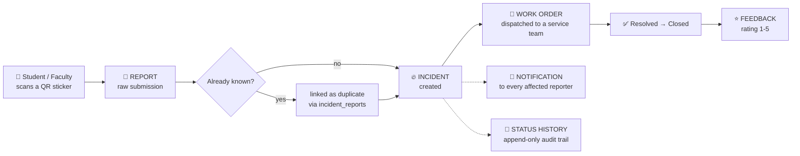
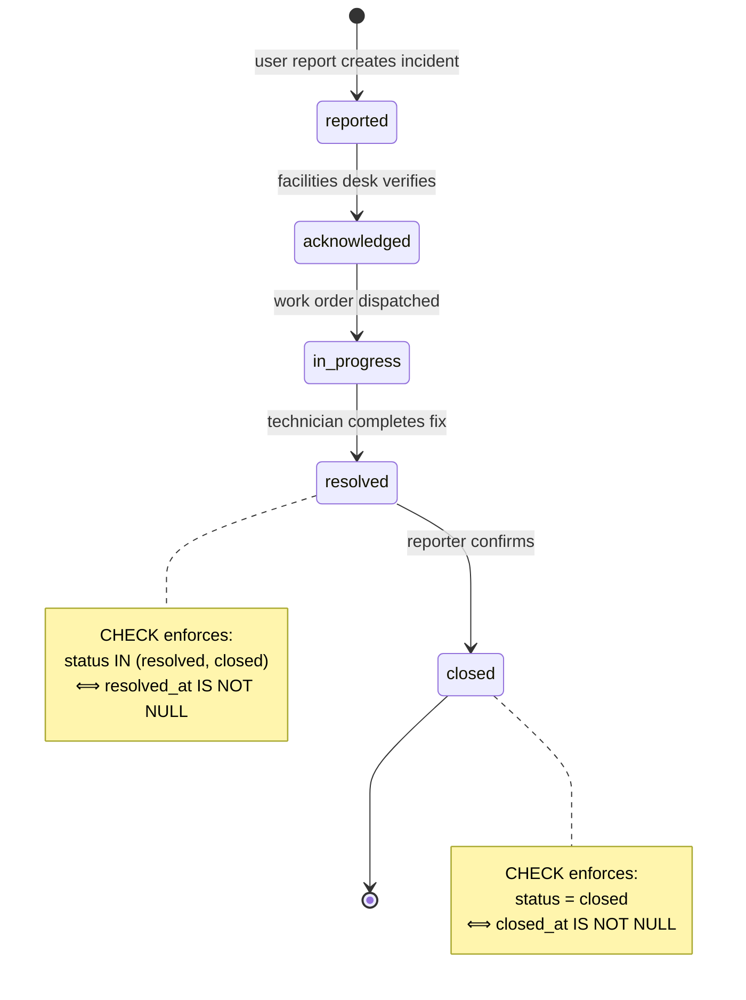

# CampusPulse — Entity Relationship Diagram

This document is the visual companion to [`DATA_DICTIONARY.md`](DATA_DICTIONARY.md),
which carries the authoritative column-by-column detail generated from the live
database catalog.

> GitHub renders the Mermaid diagrams below natively. In VS Code, install
> **Markdown Preview Mermaid Support** (`bierner.markdown-mermaid`) — it is
> already listed in `.vscode/extensions.json`.

---

## 1. The core workflow

Everything in CampusPulse exists to serve one pipeline. Read this before the
full ERD; the rest of the schema is supporting cast.



**The one idea worth remembering:** five students reporting the same broken
water dispenser produce **five reports but one incident**, so exactly **one**
technician is dispatched. `incident_reports` is the table that makes this true,
and query 5 in `04_Analytics_Queries.py` measures how much duplicate effort it
absorbs.

---

## 2. Full entity relationship diagram

```mermaid
erDiagram
    INSTITUTIONS  ||--o{ USERS          : "employs / enrolls"
    INSTITUTIONS  ||--o{ LOCATIONS      : "owns"
    INSTITUTIONS  ||--o{ CATEGORIES     : "defines"
    INSTITUTIONS  ||--o{ SERVICE_TEAMS  : "staffs"
    INSTITUTIONS  ||--o{ ASSETS         : "owns"
    INSTITUTIONS  ||--o{ REPORTS        : "receives"
    INSTITUTIONS  ||--o{ INCIDENTS      : "manages"

    LOCATIONS     ||--o{ LOCATIONS      : "contains (self-ref)"
    CATEGORIES    ||--o{ CATEGORIES     : "parent of (self-ref)"

    LOCATIONS     ||--o{ ASSETS         : "houses"
    CATEGORIES    ||--o{ ASSETS         : "classifies"

    USERS         ||--o{ USER_ROLES     : "holds extra"
    USERS         ||--o{ TEAM_MEMBERS   : "belongs to"
    SERVICE_TEAMS ||--o{ TEAM_MEMBERS   : "consists of"

    USERS         ||--o{ REPORTS        : "submits"
    ASSETS        ||--o{ REPORTS        : "is subject of"
    LOCATIONS     ||--o{ REPORTS        : "sited at"
    CATEGORIES    ||--o{ REPORTS        : "typed as"

    INCIDENTS     ||--|{ INCIDENT_REPORTS : "aggregates"
    REPORTS       ||--o| INCIDENT_REPORTS : "rolls up into"

    INCIDENTS     ||--o{ WORK_ORDERS    : "dispatches"
    SERVICE_TEAMS ||--o{ WORK_ORDERS    : "executes"
    USERS         ||--o{ WORK_ORDERS    : "assigned to"

    INCIDENTS     ||--o{ STATUS_HISTORY : "audited by"
    INCIDENTS     ||--o{ NOTIFICATIONS  : "triggers"
    INCIDENTS     ||--o{ FEEDBACK       : "rated by"
    USERS         ||--o{ NOTIFICATIONS  : "receives"
    USERS         ||--o{ FEEDBACK       : "gives"
    USERS         ||--o{ ATTACHMENTS    : "uploads"

    INSTITUTIONS {
        uuid id PK
        text name
        text code UK "AMR, NITT, VIT"
        text domain
        text city
        timestamptz created_at
    }

    USERS {
        uuid id PK
        uuid institution_id FK
        text full_name
        text email UK "unique per institution"
        user_role role "student|faculty|admin|technician"
        text department
        boolean is_active
    }

    LOCATIONS {
        uuid id PK
        uuid institution_id FK
        uuid parent_id FK "self-referencing"
        text name
        location_type type "campus|building|floor|room|area"
        text code UK
    }

    CATEGORIES {
        uuid id PK
        uuid institution_id FK
        uuid parent_id FK "self-referencing"
        text name
        category_type type "issue|asset"
        priority_level default_priority
        integer sla_hours "drives SLA analytics"
    }

    ASSETS {
        uuid id PK
        uuid institution_id FK
        uuid location_id FK
        uuid category_id FK
        text asset_tag UK "AMR-HSTB-F3-WD-0001"
        text qr_code
        asset_status status
        date purchased_on
    }

    REPORTS {
        uuid id PK
        uuid institution_id FK
        uuid user_id FK
        uuid asset_id FK "nullable"
        uuid location_id FK
        uuid category_id FK
        text description
        text photo_url
        text reported_via "qr_scan|mobile_app|web|manual|email"
        boolean is_duplicate
        timestamptz created_at
    }

    INCIDENTS {
        uuid id PK
        uuid institution_id FK
        uuid location_id FK
        uuid asset_id FK "nullable"
        uuid category_id FK
        text title
        incident_status status
        priority_level priority
        uuid created_by FK
        timestamptz created_at
        timestamptz acknowledged_at
        timestamptz resolved_at
        timestamptz closed_at
        timestamptz sla_due_at
    }

    INCIDENT_REPORTS {
        uuid id PK
        uuid incident_id FK
        uuid report_id FK "UNIQUE - one incident per report"
        boolean is_affected
    }

    WORK_ORDERS {
        uuid id PK
        uuid incident_id FK
        uuid team_id FK
        uuid assigned_to FK
        work_order_status status
        priority_level priority
        integer labour_minutes
        numeric material_cost
        timestamptz completed_at
    }

    STATUS_HISTORY {
        uuid id PK
        uuid incident_id FK
        incident_status status
        uuid changed_by FK
        text notes
        timestamptz created_at
    }

    SERVICE_TEAMS {
        uuid id PK
        uuid institution_id FK
        text name UK
        text description
        text contact_email
    }

    TEAM_MEMBERS {
        uuid id PK
        uuid team_id FK
        uuid user_id FK
        boolean is_lead
    }

    USER_ROLES {
        uuid id PK
        uuid user_id FK
        user_role role
    }

    NOTIFICATIONS {
        uuid id PK
        uuid user_id FK
        uuid incident_id FK
        notification_channel channel
        text message
        boolean is_read
        timestamptz read_at
    }

    ATTACHMENTS {
        uuid id PK
        attachment_parent table_type "polymorphic"
        uuid table_id
        text file_url
        integer file_size_kb
        uuid uploaded_by FK
    }

    FEEDBACK {
        uuid id PK
        uuid incident_id FK
        uuid user_id FK
        smallint rating "CHECK 1-5"
        text comments
    }
```



---

## 3. The incident state machine

The `incidents` table carries CHECK constraints that make illegal states
*unrepresentable* rather than merely discouraged.



Because the constraint is an **equivalence** (`⟺`), not an implication, drift is
impossible in *either* direction: you can neither mark an incident resolved
without a resolution timestamp, nor leave a stray timestamp on an open one.

---

## 4. Two structural decisions worth defending

### 4.1 Self-referencing location hierarchy

`locations.parent_id` points at `locations.id`, giving an arbitrary-depth tree:

```
Campus  →  Building  →  Floor  →  Room / Area
```

One recursive CTE then aggregates at *any* level without hard-coded joins —
demonstrated in query 12 of `04_Analytics_Queries.py`, which rolls thousands of
room-level incidents up to a per-building ranking.

Adding a "Wing" level between Building and Floor would require **zero** schema
changes.

### 4.2 Composite foreign keys for tenant isolation

Every tenant-owned table declares a redundant-looking `UNIQUE (id, institution_id)`.
That key lets children reference parents on **both** columns at once:

```sql
CONSTRAINT reports_location_same_tenant
    FOREIGN KEY (location_id, institution_id)
    REFERENCES locations(id, institution_id)
```

The consequence: a report belonging to Amrita **cannot** reference a location
belonging to VIT. PostgreSQL rejects the row. Contrast this with the common
approach of relying on the application to remember `WHERE institution_id = ?`
on every query — one forgotten predicate and tenant data leaks.

Here, the isolation is structural. `03_Verify_Data.py` re-tests all seven
cross-tenant paths to prove the constraints are actually in force.
